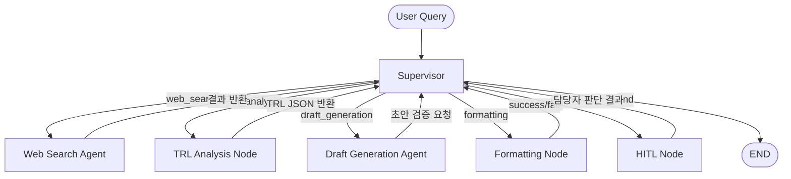

# 1. 프로젝트 개요

## 1.1 배경 및 목적

AI 인프라 확산과 함께 고성능 메모리 반도체 시장이 급격히 재편되고 있다. 특히 HBM4, PIM, CXL은 차세대 AI 가속기의 핵심 기술로 부상하며 SK하이닉스, 삼성전자, 마이크론 등 글로벌 주요 기업 간 기술 경쟁이 심화되고 있다. 본 프로젝트는 해당 기술들의 최신 R&D 동향을 자동으로 수집·분석하여, R&D 담당자가 의사결정에 즉시 활용할 수 있는 기술 전략 분석 보고서를 AI Agentic Workflow로 생성하는 것을 목적으로 한다.

**분석 대상 기술**

| 기술 | 분석 포인트 |
| --- | --- |
| HBM4 | 세대별 스펙 진화, 양산 수율, 공급 경쟁 |
| PIM | 상용화 단계, 아키텍처 방식, 적용 사례 |
| CXL | 표준화 현황, 데이터센터 적용 동향 |

**경쟁사 분석 범위**

| 구분 | 대상 기업 |
| --- | --- |
| 국내 | 삼성전자 |
| 해외 | 마이크론 (Micron) |
| 수요처 참조 | NVIDIA, Google, AWS (탑재 제품 동향 한정) |

---

## 1.2 최종 산출물 정의

웹 검색 기반 AI Agentic Workflow가 자동 생성하는 **기술 전략 분석 보고서** 1종

- 포함 내용 : 분석 배경 / 기술 현황 / 경쟁사 동향 / TRL 기반 기술 성숙도 비교 / 전략적 시사점
- 활용 대상 : R&D 전략 담당자
- 형식 : **PDF 보고서** (Markdown 초안 → PDF 변환)

---

# 2. Agentic Workflow 설계

## 2.1 Goal

> HBM4·PIM·CXL 3개 기술에 대해 웹 검색을 통해 최신 R&D 정보를 수집하고, 경쟁사별 기술 성숙도와 위협 수준을 분석하여 R&D 담당자가 즉시 활용 가능한 기술 전략 분석 보고서를 자동 생성한다.
> 

---

## 2.2 Success Criteria

| 기준 | 세부 내용 |
| --- | --- |
| **커버리지** | HBM4·PIM·CXL 3개 기술 모두 분석 포함 |
| **경쟁사 완결성** | 삼성전자·마이크론 2사 모두 비교 포함 |
| **정보 최신성** | 수집 정보 기준 **최근 3개월 이내** 자료 포함 여부 |
| **TRL 평가 포함** | 각 기술·기업별 TRL 단계 명시 |
| **보고서 구조** | SUMMARY / 5개 장 / REFERENCE 목차 완비 (총 7개 섹션) |
| **출처 명시** | 분석 근거가 된 웹 소스 URL 참조 가능 |

---

## 2.3 Task Decomposition

```markdown
Goal: SK하이닉스 R&D 담당자를 위한 HBM4·PIM·CXL 기술 전략 분석 보고서 자동 생성
│
├─ T1. 키워드 및 경쟁사 추출
│     topics(HBM4, PIM, CXL) × competitors(Samsung, Micron) 조합으로
│     검색 쿼리 자동 구성 (prompts/ 폴더 기반)
│     date_range: 최근 3개월 필터 적용
│
├─ T2. 웹 검색 및 정보 수집
│     ├─ 긍정/부정/중립 관점 쿼리 복수 실행 (확증 편향 방지)
│     ├─ 소스 신뢰도 계층 설정 (논문 > 뉴스 > 블로그)
│     ├─ 확증 편향 검증 (bias_check)
│     │     편향 감지 시 → 보완 쿼리 재검색 (max 2회)
│     │     2회 초과 시 → HITL 개입
│     └─ 도메인 중복 수집 상한 적용 (동일 도메인 최대 N건)
│
├─ T3. TRL 기반 기술 성숙도 분석
│     ├─ TRL 1~3: 논문·특허 기반 확정 (basis: confirmed)
│     ├─ TRL 4~6: 간접 지표 3종 기반 추정 (basis: estimated)
│     │     (특허 출원 패턴, 학회 발표 빈도, 채용 공고 키워드)
│     │     → 보고서에 "추정" 명시
│     └─ TRL 7~9: 양산·출하 발표 기반 확정 (basis: confirmed)
│
├─ T4. 보고서 생성
│     ├─ Draft 생성 (7개 섹션)
│     ├─ Draft 검증 (quality_scores 기반, LLM 평가)
│     │     ├─ summary_score
│     │     ├─ coverage_score
│     │     ├─ evidence_score
│     │     └─ consistency_score
│     └─ 검증 미달 시 → Draft 재생성 (max 2회)
│
└─ T5. 최종 보고서 생성 (Markdown → PDF)
```

---

## 2.4 Control Strategy

**에이전트 제어 방식 : Supervisor 구조**

Supervisor Agent가 T1~T5의 실행 순서를 관장하며, 각 단계의 출력 품질을 검증한 후 다음 단계로 전달한다.

| 상황 | 대응 전략 |
| --- | --- |
| **검색 결과 없음** | 쿼리 재구성 후 1회 재시도, 실패 시 해당 항목 "정보 없음"으로 표기 후 진행 |
| **정보 편향 가능성** | 기업별 공식 발표 + 제3자 분석 자료(시장조사기관, 학술) 혼합 수집 |
| **정보 품질 미달** | Supervisor가 정제 결과 검토 후 T2 재수행 여부 결정 (**최대 2회**) |
| **보고서 구조 누락** | 목차 항목 체크리스트 기반으로 누락 섹션 감지 → 해당 섹션만 재생성 (**최대 2회**) |
| **무한 루프 방지** | **각 Task별 최대 재시도 2회 고정**, 초과 시 강제 종료 후 오류 로그 기록 |

---

# 3. 시스템 구조 설계

## 3.1 아키텍처 선택 근거

**선택 : Supervisor 구조**

본 프로젝트는 웹 검색 → 초안 생성 → 보고서 포맷팅의 **선형적이고 순차적인 흐름**을 가진다. 각 단계의 출력이 다음 단계의 입력이 되는 의존 관계가 명확하므로, 각 에이전트가 독립적으로 병렬 실행되는 Distributed 구조보다 **Supervisor가 실행 순서와 품질을 중앙에서 관장하는 구조가 적합**하다.

| 비교 항목 | Supervisor | Distributed |
| --- | --- | --- |
| 실행 흐름 | 순차 제어 | 병렬 독립 |
| 품질 검증 | Supervisor가 단계별 검증 | 에이전트 자체 판단 |
| 오류 대응 | 중앙 집중 재시도 | 에이전트별 독립 처리 |
| 본 프로젝트 적합성 | 적합 | 과설계 |

---

### 3.2 전체 Workflow 다이어그램




---

## 3.3 Agent 간 데이터 흐름

모든 에이전트는 **공유 State 객체**(6.1 정의 참조)를 통해 데이터를 주고받으며, Supervisor가 각 단계에서 State를 업데이트·검증한다.

---

# 4. Agent 정의

## 4.1 에이전트 목록 및 R&R 요약표

| Agent | 역할 | Input | Output |
| --- | --- | --- | --- |
| Supervisor | 전체 Task 분배, 순서 제어, QA, 재시도 판단(max 2회), 최종 승인 | User Query (분석 토픽, 경쟁사 목록) / 각 Agent·Node 반환 결과 | route_next 함수로 다음 노드 결정 |
| Web Search Agent | 웹·논문·특허·채용·IR 정보 수집 및 확증 편향 방지 | 토픽 키워드 + 날짜 범위(3개월) + 경쟁사 목록 | 수집 문서 스니펫 + 메타데이터 |
| TRL Analysis Node | 수집 자료 기반 TRL 구간 판단 및 추정 | Web Search Agent 수집 결과 | TRL JSON (trl + basis + evidence + confidence + limitation) |
| Draft Generation Agent | TRL JSON 기반 보고서 초안 합성 (7개 섹션) | TRL JSON + Web Search Agent 수집 문서 | Markdown 보고서 초안 |
| HITL Node | 품질 미달 케이스 담당자 직접 검토 | bias_check 2회 초과 미달 시의 결과 | 담당자 판단 결과 (수정 지시 또는 승인) |
| Formatting Node | 최종 보고서 포맷 변환 | 승인된 Markdown + TRL JSON | **PDF** + 완료 신호 (success/fail) |

---

## 4.2 개별 에이전트 상세 정의

### 4.2.1 Supervisor Agent

- **하는 일** : 사용자 요청 수신 → topics(HBM4·PIM·CXL) × competitors(Samsung·Micron) 조합으로 검색 쿼리 자동 구성 → 각 Agent 순차 호출 → 결과 품질 검증 → 재시도 or 완료 판단
- **사용 도구** : LangGraph Supervisor 노드, 체크리스트 기반 품질 검증 프롬프트, prompts/ 폴더 기반 쿼리 템플릿
- **호출 시점** : 워크플로우 시작 시 및 각 Agent·Node 결과 반환 시마다 개입
- **재시도 조건** : 섹션 누락, 경쟁사 미포함, TRL 평가 부재, 편향 검증 실패 시 해당 Agent 재호출 (**최대 2회**)

---

### 4.2.2 Web Search Agent

- **하는 일** : Supervisor가 구성한 쿼리로 웹 검색을 수행하여 원문 텍스트를 수집·분류. 확증 편향 방지 및 소스 다양성 점수 산출
- **웹 검색 품질 평가 기준**

| 점수 | search_richness (검색 풍부도) | bias_score (확증 편향 부재) |
| --- | --- | --- |
| 5 | 15건 이상, 논문·뉴스·블로그 모두 포함 | 긍정·부정·중립 균형, 자기비판 쿼리 결과 존재 |
| 4 | 10건 이상, 2개 소스 유형 이상 | 긍정·부정 비율 7:3 이내 |
| 3 | 7건 이상, 2개 소스 유형 이상 | 긍정·부정 비율 8:2 이내 |
| 2 | 5건 이상, 단일 소스 유형 | 긍정 관점 편중, 부정 결과 2건 미만 |
| 1 | 5건 미만, 내용 빈약 | 단일 관점만 수집 |
- **사용 도구** : Web Search Tool (Tavily / SerpAPI 등), LLM (쿼리 생성)
- **호출 시점** : Supervisor가 검색 지시 시 / bias_check 실패로 보완 쿼리 재검색 필요 시 (**max 2회**)
- **HITL 트리거** : bias_check **2회 재시도 후에도** 다양성 점수 미달 지속 시 HITL Node 호출
- **확증 편향 방지** : 기업 공식 발표 + 시장조사기관(TrendForce 등) + 비관적 전망 쿼리를 병행 실행. 소스 다양성 점수 산출하여 Supervisor에 반환

### 확증 편향 방지 전략 — 상세

**① 기업 공식 발표 수집**

목적 : 기업이 직접 발표한 스펙·로드맵 확보 (과장 가능성 존재)

```python
queries = [
    "SK하이닉스 HBM4 공식 발표 2025 2026",
    "Samsung HBM4 press release official",
    "Micron HBM4 roadmap announcement",
    "SK hynix PIM AiMX official spec",
]
priority_domains = [
    "news.skhynix.co.kr",
    "semiconductor.samsung.com",
    "investors.micron.com",
]
```

한계 : 기업은 자사에 유리한 정보만 공개 → 단독 사용 시 편향 발생

**② 제3자 시장조사기관 자료 수집**

목적 : 독립적 시각의 기술 성숙도·시장 점유율·위협 수준 확보

```python
queries = [
    "HBM4 market share 2026 TrendForce analysis",
    "PIM commercialization status Gartner IDC",
    "CXL adoption rate analyst report 2025",
    "HBM competitive landscape CounterPoint Research",
]
target_sources = ["TrendForce", "CounterPoint", "Gartner", "IDC"]
```

역할 : 기업 발표와 교차 검증하는 레퍼런스 포인트

**③ 비관적 전망 쿼리 병행 실행**

목적 : 긍정적 정보만 수집되는 구조적 편향 차단

```python
query_pairs = [
    ("HBM4 SK하이닉스 시장 선도 전망"),
    ("HBM4 기술 검증 지연 문제 리스크"),

    ("PIM 상용화 성공 사례"),
    ("PIM 상용화 실패 과제 한계"),

    ("CXL 데이터센터 확산 전망"),
    ("CXL 도입 지연 이유 장벽"),

    ("Samsung HBM4 경쟁력"),
    ("Samsung HBM 퀄테스트 실패 이슈"),
]
```

구현 방식 : 각 기술·기업 쿼리에 대해 반드시 `"리스크"`, `"한계"`, `"지연"`, `"문제"` 키워드가 포함된 대응 쿼리를 자동 생성하여 병행 실행

**④ 소스 다양성 점수 산출**

```python
diversity_score = {
    "domain_variety": 수집된 고유 도메인 수 / 전체 수집 건수,
    "source_type_ratio": {
        "official": 기업 공식 발표 비율,
        "analyst": 시장조사기관 비율,
        "academic": 논문·학술 비율,
        "news": 뉴스 비율,
    },
    "domain_cap": "동일 도메인 최대 N건 상한 적용"
}
```

기준 : diversity_score 미달 시 → bias_check 실패 판정 → 보완 쿼리 재검색 (**max 2회**) → 초과 시 HITL

### 세 전략 적용 흐름 요약

```
Web Search Agent 실행 시
│
├─ 기업 공식 발표 쿼리   → 공식 도메인 우선 수집
├─ 시장조사기관 쿼리     → 제3자 분석 자료 수집
└─ 비관 쿼리 병행        → 리스크·한계 정보 수집
         │
         ▼
   소스 다양성 점수 산출
         │
   ├─ 통과 → TRL Analysis Node에 전달
   └─ 미달 → 보완 쿼리 재검색 (max 2회)
              미달 지속 시 → HITL
```

---

### 4.2.3 TRL Analysis Node

- **하는 일** : 수집 자료 기반 TRL 구간을 1차 판단하고, 구간별 로직으로 재분석하여 TRL 추정값·근거·신뢰도·한계를 출력
- **사용 도구** : LLM (TRL 평가 프롬프트)
- **호출 시점** : Web Search Agent 결과 반환 후 Supervisor가 TRL 분석 지시 시
- **로직**
    - TRL 1-3 : 논문·특허 직접 확인 → `basis: confirmed` / `limitation: null`
    - TRL 4-6 : **간접지표 3종**(특허 출원 패턴·채용 공고 키워드·학회 발표 빈도) 기반 추정 → `basis: estimated` / 보고서에 "추정" 명시 필수
    - TRL 7-9 : 양산 발표·고객사 납품 공시 직접 확인 → `basis: confirmed` / `limitation: null`
- **출력 형식**

```json
{
  "company": "Samsung",
  "tech": "HBM4",
  "trl": 7,
  "basis": "confirmed",
  "confidence": "medium",
  "evidence": [
    "2024Q3 특허 키워드 공정·수율로 이동",
    "ISSCC 2025 구체적 수치 발표",
    "수율 엔지니어 채용 급증"
  ],
  "limitation": "Samsung 공개 보수적 → 실제보다 낮게 추정됐을 가능성 있음"
}
```

- **confidence 기준** (간접지표 3종 기준)
    - High : 지표 **3개 모두** 동일 방향
    - Medium : 지표 **2개** 동일 방향
    - Low : 지표 충돌 또는 1개 이하 확인
- **회사별 보정** : Samsung은 공개 보수적 → 동일 조건에서 confidence 한 단계 하향

---

### 4.2.4 Draft Generation Agent

- **하는 일** : TRL Analysis Node 출력 JSON과 수집 문서를 바탕으로 보고서 **7개 섹션** 초안을 작성. LLM 기반 quality_scores로 자체 검증 수행
- **7개 섹션 구성** : summary / background / tech_status / competitor / trl_assessment / insight / reference
- **draft 품질 평가 기준**

| 점수 | summary_score (요약 완결성) | coverage_score (섹션 완결도) | evidence_score (근거 명시) | consistency_score (내부 일관성) |
| --- | --- | --- | --- | --- |
| 5 | SUMMARY 완전 포함, 분량·핵심 메시지 충족 | 7개 섹션 전부 완결 | 모든 주장에 URL 출처 존재, Reference 완전 매칭 | 섹션 간 모순 없음 |
| 4 | SUMMARY 존재, 일부 핵심 누락 | 6개 섹션 완결 | 주장의 80% 이상 출처 존재 | 경미한 표현 불일치 1건 이하 |
| 3 | SUMMARY 분량 부족 | 5개 섹션 완결 | 주장의 60% 이상 출처 존재 | 섹션 간 불일치 1~2건 |
| 2 | SUMMARY 불완전 | 4개 섹션 완결 | 주장의 40% 이상 출처 존재 | 섹션 간 상충 내용 존재 |
| 1 | SUMMARY 부재 또는 무의미 | 3개 이하 섹션 완결 | 출처 없는 주장 다수 | 섹션 간 명백한 모순 다수 |
- **사용 도구** : LLM (GPT-4o), 보고서 작성 프롬프트, LLM 평가 프롬프트
- **호출 시점** : TRL Analysis Node 결과 반환 후 Supervisor가 초안 작성 지시 시 / QA 실패로 재작성 필요 시
- **서술 기준**
    - `basis = confirmed` → "확인됨"으로 서술
    - `basis = estimated` → "추정됨 + 한계 명시"로 서술
- **재시도 조건** : quality_scores 미달 시 Draft 재생성 (**최대 2회**)
- **2회 초과 시** : 강제 종료 후 오류 로그 기록 (HITL 미개입)

---

### 4.2.5 HITL Node

- **하는 일** : bias_check 2회 재시도 후에도 다양성 점수 미달 지속 시 담당자가 직접 검토하고 수정 지시 또는 승인 판단
- **사용 도구** : 담당자 수동 검토
- **호출 시점** : **Web Search bias_check 2회 재시도 후에도 다양성 점수 미달 지속 시에 한정**
- **출력** : 담당자 판단 결과 (재검색 지시 또는 현재 결과로 진행 승인) → Supervisor 반환

---

### 4.2.6 Formatting Node

- **하는 일** : 승인된 초안을 SUMMARY / 5개 장 / REFERENCE (총 7개 섹션) 목차에 맞게 구조화하고 최종 보고서를 **PDF**로 출력
- **사용 도구** : LLM (포맷팅 프롬프트), Markdown 렌더러, PDF 변환기 (Pandoc + XeLaTeX 등)
- **호출 시점** : Supervisor가 초안 최종 승인 후 포맷 변환 지시 시
- **제약** : TRL 4-6 간접지표 추정 면책 문구 자동 삽입 필수
- **최종 산출물** : **PDF 파일**
- **실패 처리** : 변환 실패 시 Markdown 원본 보존 후 fail 신호 → Supervisor 반환

---

# 5. TRL 추정 방법론

TRL 4~6 구간은 수율·공정 파라미터가 핵심 영업 비밀이라 직접 확인이 불가능하다.
따라서 **공개 정보 기반 간접지표 3가지**를 조합하여 추정하며, 보고서 내 해당 수치는 반드시 "추정"으로 명시한다.

| 지표 | 수집 출처 | TRL 신호 |
| --- | --- | --- |
| 특허 출원 패턴 | USPTO·KR·JP 특허 DB | 키워드가 "원천 기술"→"공정·수율"로 이동 시 TRL 상승 |
| 학회 발표 패턴 | ISSCC·Hot Chips·arxiv | 수치 구체성 증가 → TRL 상승 / 발표 급감 → TRL 6~7 진입 가능성 |
| 채용 공고 키워드 | LinkedIn·각사 채용 페이지 | "연구원"→"공정·수율·양산 엔지니어"로 변화 시 TRL 5~6 신호 |

**보조 참고자료** (TRL 산정에는 미사용, 근거 보강용)

- 파트너십·공급망 발표 (IR 자료·뉴스)
- IR·실적 발표 언어 변화

### Confidence 등급

| 등급 | 조건 |
| --- | --- |
| High | 지표 3개 모두 동일 TRL을 가리킬 때 |
| Medium | 지표 2개가 동일 TRL을 가리킬 때 |
| Low | 지표가 충돌하거나 1개 이하만 확인 가능할 때 |

※ Samsung처럼 공개를 꺼리는 회사는 동일 조건에서 Confidence를 한 단계 낮춰 설정한다.

---

# 6. State 정의

## 6.1 State 정의

```python
class State(TypedDict):
    # 입력 (T1)
    topics: List[str]                   # ["HBM4", "PIM", "CXL"]
    competitors: List[str]              # ["Samsung", "Micron"]
    date_range: Dict[str, str]          # {"from": "YYYY-MM-DD", "to": "YYYY-MM-DD"}
                                        # 최근 3개월 필터링용

    # Supervisor 제어용
    retry_count: int                    # 재시도 횟수 (max 2)
    error_log: Annotated[List[str],
                         operator.add]  # 오류 누적 기록

    # Web Search Agent (T2)
    search_results: List[Dict]          # 수집된 웹 검색 결과
                                        # {"query": ..., "title": ...,
                                        #  "url": ..., "content": ...,
                                        #  "perspective": "positive|negative|neutral",
                                        #  "source_type": "paper|news|blog",
                                        #  "published_date": "YYYY-MM-DD"}
    bias_check: bool                    # 확증 편향 검증 통과 여부
    bias_retry_count: int               # bias 재시도 (max 2)
    hitl_approved: Optional[bool]       # HITL 진행 여부 결정
                                        # None: 미도달 / True: 진행 / False: 중단
    warning_flag: bool                  # 검색 품질 미달 상태로 진행 여부
                                        # True 시 Draft Agent가 초안에 경고 문구 삽입

    # TRL 분석 (T3)
    trl_assessment: Dict[str, Dict]     # 기술별·경쟁사별 TRL 평가 결과
    # {"HBM4": {"Samsung": {"trl": 8,
    #                        "basis": "confirmed",
    #                        "confidence": "high",
    #                        "evidence": [...],
    #                        "limitation": null},
    #            "Micron":  {"trl": 6,
    #                        "basis": "estimated",
    #                        "confidence": "medium",
    #                        "evidence": [...],
    #                        "limitation": "..."}},
    #  "PIM":  {...}, "CXL": {...}}

    # Draft Generation Agent (T4)
    draft_content: Dict[str, str]       # 7개 섹션별 초안
                                        # {"summary": ...,
                                        #  "background": ...,
                                        #  "tech_status": ...,
                                        #  "competitor": ...,
                                        #  "trl_assessment": ...,
                                        #  "insight": ...,
                                        #  "reference": ...}
    draft_retry_count: int              # 초안 재작성 횟수 (max 2)
    quality_scores: Dict[str, int]      # 다차원 품질 점수
    # Web Search Agent 책임:
    #   {"search_richness": 1~5,
    #    "bias_score":      1~5}
    # Draft Generation Agent 책임:
    #   {"summary_score":     1~5,
    #    "coverage_score":    1~5,
    #    "evidence_score":    1~5,
    #    "consistency_score": 1~5}

    # Formatting Node (T5)
    final_report_md: str                # Markdown 초안
    final_report_pdf_path: str          # PDF 최종 산출물 경로
```

---

EOD